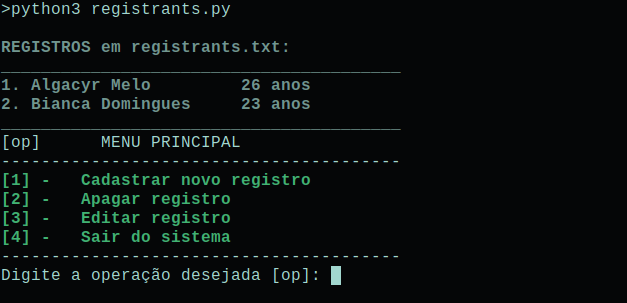

# Register
Basic program with CRUD concepts I learned by CursoEmVideo on my first programming course

## Preview


## Installation
*Download ZIP:*
- Download the project in **Code > Download ZIP**
- Extract the ZIP file

**OR**

*Clone:*
```bash
git clone <URL>
```

## Usage
- Change to the project directory on terminal
```bash
cd <PATH>/<PROJECT_DIR>
```
- Run the project
```bash
python3 registrants.py
```
